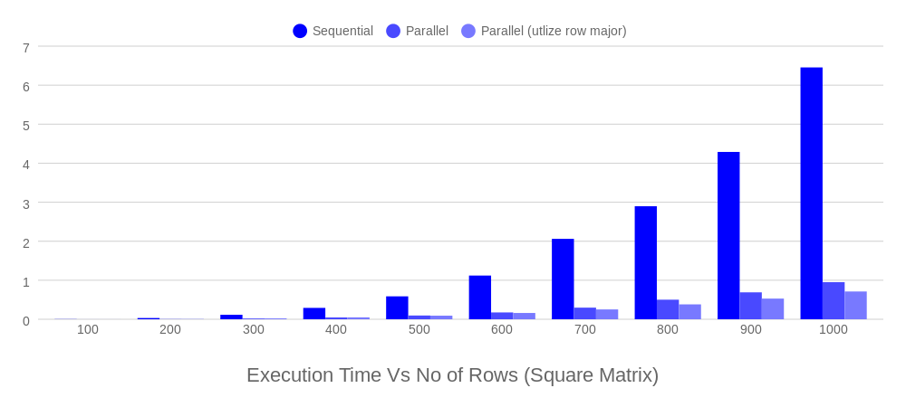

# parallel-matrix-multiplication

Analyzing the performance of matrix multiplication in parallel environment. Naive multiplication of 2 square matrices with 10, 100, 1000 number of rows was considered for this study. This operation was optimized to perform on CPU and GPU using OpenMP and CUDA.

## Experiment

### Utilizing CPU Threads

    

The parallel execution was done using 12 Threads. We can see that parallel execution speeds up the operation by roughly 7x for 1000x1000 matrix multiplication. Only outer loop was parallelized, so each thread will perform same instructions on a specified set of rows. But major problem is, we are not utilizing cache for 2nd matrix. Usually, we multiply each row elements of first matrix with column elements of second matrix to get single element of resultant matrix. But arrays in C is row major, which means, row elements are arranged next to each other in memory. So, usually when we take a element from a row in second matrix, its neighbors will also get stored into cache but we are not using those and we straightly go to next row. This is a wastage, so in order to make operation favorable for cache, an optimized method which utilizes row major, is used as 3rd method. The 3rd method speeds up the naive implementation by roughly 9x for 1000x1000 matrix multiplication.

    

The above figure shows execution of 3rd method for 1000x1000 matrix multiplication with different number of threads.

See this medium [post](https://medium.com/@karthicktsharma/parallel-matrix-multiplication-7e2e0efa64f4) for more infomation.

## Execution Environment

- CPU - Intel Core i7-8750H @ 2.20GHz
- GPU - GTX 1050 Ti
